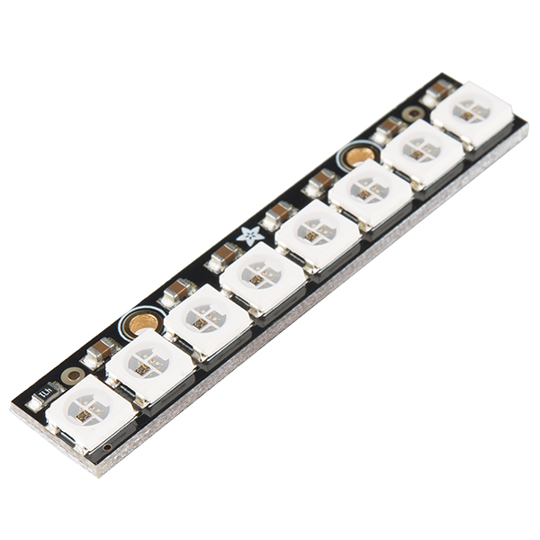

# Pepperkakehus

Å finne på artige små greier man kan lage er en fin måte å lære på, og hvorfor ikke lage noe nyttig med det samme? Tradisjon tro skal det være pepperkakehus til jul, og det er jo mye finere med lys i. Siden det gamle lyspærebaserte lyset er ødelagt fikk jeg i et år sjansen til å finne på noe nytt. I disse IoT-tider må jo også pepperkakehuset kunne styres via internett.


I dette prosjektet bruker jeg en NeoPixel LED stripe med 8 lysdioder som kan styres individuelt i alle farger. Styringen gjøres vis en ESP8266, som enkelt sagt er en Arduino med wifi. Jeg sender meldinger til denne via en MQTT (meldingskø). I første omgang sender jeg meldinger generert i Node-RED. Node-RED og Mosquitto (for MQTT) kjører jeg på en Raspberry Pi 3.


## Mikrokontrolleren

Jeg har prøvd flere mikrokontrollere med varierende hell:

* ESP-01
* ESP-12F
* NodeMCU D1 Mini

Alle er billige. På Ebay får du dem fra 16 til 30 kroner stykket. Alle programmeres enkelt via Arduino IDE. Jeg endte opp med den siste (NodeMCU) etter å ha ødelagt de to forrige. Måten jeg ødela dem på var å forsøke å oppdatere dem over wifi (OTA). Dette er i utgangspunktet mulig, men bare hvis programmet tar mindre en halvparten av det tilgjengelige minnet. Mitt program tok over halvparten, så etter jeg hadde forsøkt oppdatering var de ikke brukbare lenger. Det nyttet heller ikke å programmere dem via seriekabel (og USB). Etter litt googling konkluderte jeg med at jeg mest sannsynlig har skrevet over en del av minnet som jeg ikke skulle ha skrevet til. NodeMCU har derimot mer minne, så den gikk fint oppdatere OTA.

### ESP-01


Denne er liten og enkel å koble til, og klarer seg utmerket så lenge man bare trenger én data-utgang. Den leveres vanligvis ferdig med pinner der man kan koble til ledningene. Den er imidlertid litt omfattende å programmere, da man må ha en FTDI-adapter og en del ledninger tilkoblet.

Under programmering (flashing) må GPIO 0 kobles til GND, mens under bruk må den kobles til 3,3V. CH-PD må kobles til 3,3V både under programmering og under bruk. 

Jeg har laget en egen beskrivelse av [hvordan man programmerer og bruker en ESP-01](https://github.com/Itema-as/smoky/blob/master/doc/ESP8266%20Programming.md).


### ESP-12F


Denne leveres i mange utgaver. 12E og 12F er svært like. Den jeg hadde måtte loddes på et lite print-kort, der jeg også loddet fast pinner for å koble ledningene på. Man kan selvfølgelig lodde ledninger direkte på den, men da er det vanskeligere å endre. Den programmeres på samme måte som ESP-01. Det er altså litt omfattende.


### NodeMCU D1 Mini


Denne er litt mer avansert enn de to andre, og bare noen få kroner dyrere. Den har flere fordeler:

* Denne har mer minne enn de andre, så den fikk jeg til å programmere OTA (via wifi). 
* Den har den USB-tilkobling, så den er mye enklere å programmere via kabel.
* Den kan brukes på 5V. De andre to må ha 3,3V.
* Den kan brukes med bare strøm tilkoblet, samt den ene data-utgangen. (GPIO-0 og CH-PD trenger ikke tilkobles.)

## LED-stripa



Jeg brukte en NeoPixel Stick med 8 LEDS, bare fordi jeg hadde et par stykker liggende. Disse styres meget enkelt via AdaFruid_NeoPixel library. Her er en god [beskrivelse](https://learn.adafruit.com/adafruit-neopixel-uberguide/overview). Det finnes andre bibliotek for mer avansert bruk.

Disse lysdiodene finnes i mange forskjellige utgaver. De kan kobles sammen i lange rekker, og fortsatt styres enkeltvis med den ene datakabelen.

## Strømforsyninga

### NodeMCU

NodeMCU har Micro-USB port og kan forsynes med 5V via denne. LED-stripa kan forsynes fra 5V-kontakten på kortet. Dermed trenger man bare en USB-lader og en kabel, så kan den lyse hele jula.

### ESP-01 og ESP-12F

Som strømforsyning til disse har jeg brukt en enkel omformer som kan ta 6-12V inn og levere både 3,3V og 5V ut. LED-stripa tar gjerne 5V, mens de to enkleste mikrokontrollerne begge skal ha 3,3V. 


## Problemer med restarting

Av en eller annen grunn restarter mikrokontrolleren med ujevne mellomrom. Jeg har foreløpig ikke identifisert årsaken til dette, men det skjer uavhengig av hva jeg bruker til strømforsyning.

Etter at jeg implementerte lagring av innstillinger i EEPROM er dette ikke noe stort problem.

## Koblingskjema

Koblingen er så enkel at du nesten kan gjøre det ut fra bildet øverst, men her er en enkel beskrivelse:

Mikrokontrolleren NodeMCU skal ha strøm (5V og GND) fra strømforsyninga.

LED-stripa skal ha strøm (5V og GND) fra strømforsyninga.

I tillegg skal Din på LED-stripa kobles til D4 på NodeMCU.

Deretter er det bare å koble strøm til strømforsyninga. Hvis alt virker skal 4 lysdioder tenne med hvitt lys etter noen sekunder. 

## Arduino-koden

Koden finnes i fila Pepperkakehus.ino. Denne koden setter opp LED-stripa:

``` c
// NeoPixel
#define PIN 2
#define NUM_LEDS 8
Adafruit_NeoPixel strip = Adafruit_NeoPixel(NUM_LEDS, PIN, NEO_GRB + NEO_KHZ800);

struct Settings {
  int version; // Figure ot if data has been saved before
  int r;
  int g;
  int b;
  int numLeds;
  int brightness;
};
Settings settings;

#define SETTINGS_VERSION 100
#define DEFAULT_R 90
#define DEFAULT_G 90
#define DEFAULT_B 0
#define DEFAULT_N 8
#define DEFAULT_L 75
```

PIN 2 står for GPIO2, som er D4 på NodeMCU. Denne er praktisk, da den står rett ved siden av GND og VCC, så man kan feste sammen alle de tre kablene som er i bruk. 

NUM_LEDS er antall lysdioder.

Variablene i settings leses fra EEPROM ved oppstart. numLeds er antall lysdioder som er tent. r, g og b er fargene r, g og b. Biblioteket skal ha verdier mellom 0 og 255, men jeg setter de mellom 0 og 100, da det er enklere å tenke i prosent enn i 255-deler. Brightness bestemmer nivå samlet for alle LEDs og alle farger. Settes også mellom 0 og 100.

NB! Jeg er usikker på om default-verdiene fungerer første gang. Da jeg hadde oppgradert var det mørkt helt til jeg begynte å stille inn fargene.

Farger kan styres for hver enkelt LED, men her setter jeg alle tente LEDs likt, for enkelhets skyld.

Andre deler av koden styrer wifi, MQTT og OTA update (oppdatering over wifi), og skal være nokså selvforklarende.

Jeg hadde litt problemer med at jeg mistet kontakten med den, men etter at jeg la inn linjen `if(WiFi.status() != WL_CONNECTED) connectWifi();` i loop() ser det problemet ut for å være borte.

### Konfig

Det er en del konfigurasjon i koden som du må sette riktig. Disse finnes nær toppen av koden. Jeg bruker ei egen fil som heter settings.h der jeg skriver de hemmelige passordene. Denne legger jeg ikke med den publiserte koden på github. Du kan gjøre det på samme måte, eller du kan legge dine passord rett inn i koden og la være å bruke settings.h.

Her er de instillingene du MÅ gjøre noe med:

Wifi:

``` c
const char* wifiSsid = "wifi-navn";
const char* wifiPassword = WIFIPASSWORD;
```

MQTT:

```c
const char* mqttServer = "10.0.0.15"; // IP-nummer til Raspbery Pi
const char* mqttUser = "mqtt-brukernavn";
const char* mqttPassword = MQTTPASSWORD;
const long mqttPort = 1883;
```


## Raspberry Pi 3 som IoT server

Jeg har en Raspberry Pi 3 som gjør en glimrende jobb som IoT-server. Her har jeg installert Mosquitto som er en MQTT broker, og Node-RED der jeg syr sammen tjenestene i en slags orkestrering. Jeg har også programvarene weewx som laster ned data fra værstasonen og publiserer dem også på meldingskøa.

### Mosquitto

Mosquitto installeres enkelt slik:

``` bash
sudo apt-get install mosquitto
sudo apt-get install mosquitto-clients
```

Opprett ei config-fil (filnavn må slutte med .conf) i `/etc/mosquitto/conf.d` mappa. Her er min:

``` bash
# My own config
allow_anonymous false
password_file /etc/mosquitto/password_file
```

Dette gjør at det kreves brukernavn og passord for å få tilgang til MQTT. Disse opprettes med kommandoen `mosquitto_passwd`. Det hele kan testes med disse to kommandoene som skrives i hvert sitt terminalvindu:

``` bash
mosquitto_sub -u username -P password -t "#" -v
mosquitto_pub -u username -P password -t tullball -m Heiduder
```

Hvis det virker vil "Heiduder" komme i terminalvindu nr. to.


### Node-RED

Jeg fulgte [disse instruksjonene](https://www.digitalocean.com/community/tutorials/how-to-connect-your-internet-of-things-with-node-red-on-ubuntu-16-04) for installasjon av Node-RED. Hadde allerede Node.js og npm installert.

Husk en endring i start-scriptet `/etc/systemd/system/node-red.service`: Endre stien til node-red-pi for ExecStart fra `/usr/local/bin` til `/usr/bin`. Også endre bruker `sammy` til din egen.

Når Node-RED kjører aksesserer du den via nettleseren med IP-nummer og portnummer. Esempel: `http://10.0.0.15:1880/#`.

Jeg har laget en enkel flow bare for å sette noen verdier slik:


Pepperkakehus er en MQTT output node, der jeg har lagt inn:

* IP-adressen til Raspberry Pi serveren (som kjører Mosquitto/MQTT)
* Portnummer til MQTT (standard er 1883)
* MQTT brukernavn
* MQTT passord

Brukernavn og passord er som satt med `mosquitto_passwd` ovenfor.

De andre nodene setter forskjellige verdier for farge, antall LEDs og lysstyrke. Eksempel:


Denne setter fargen rød på fullt. Verdier som kan settes er:

* r (rød)
* g (grønn)
* b (blå)
* n (antall LEDs)
* l (lysstyrke)

Jeg har utvidet Node-RED med Node-RED Dashboard og enkelt laget sliders og en color picker for å endre fargene. Har ikke lagt så mye jobb i dette, men det fungerer brukbart.

